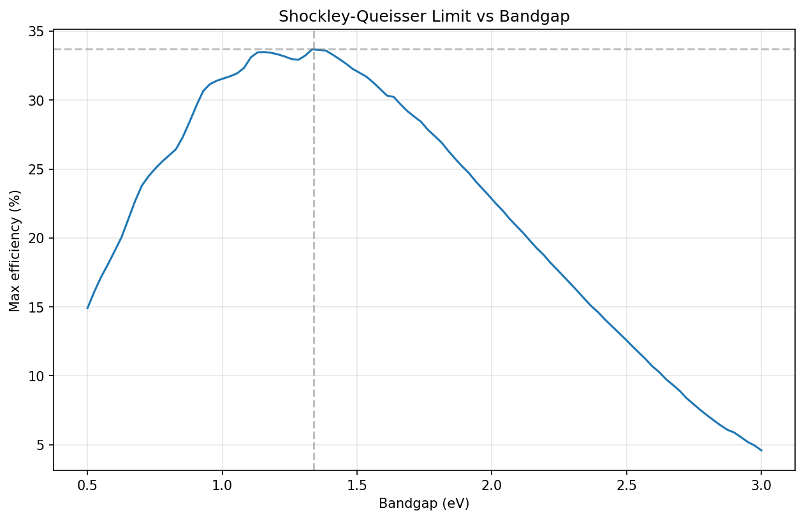

# Perovskite-sq-audit1
# Perovskite SQ Audit

A from-scratch Shockley-Queisser efficiency calculator for single-junction solar cells, built as a tool to audit published efficiency claims against the fundamental physical limit.

## What it does

Given a semiconductor bandgap, this calculator computes the maximum possible solar cell efficiency under the AM1.5G solar spectrum, using detailed balance (the Shockley-Queisser limit). It works through the full physics chain: loading the solar spectrum, converting it to photon flux, computing short-circuit current (J_sc), the radiative dark current (J_0), open-circuit voltage (V_oc), and finally efficiency. Sweeping across bandgaps reproduces the classic efficiency-vs-bandgap curve.

## Validation

The calculator is checked against two known results:

- **Total solar irradiance:** integrating the AM1.5G spectrum gives 1000.4 W/m², matching the defined "one sun" standard.
- **Shockley-Queisser limit:** the efficiency peaks at 33.7% at a bandgap of 1.34 eV, matching the canonical detailed-balance result.

## How to run

1. Install dependencies: `pip install pvlib numpy scipy matplotlib pandas`
2. Open `sq_calculator.ipynb` in Jupyter
3. Run all cells

## Limitations

This computes the **radiative (ideal) limit** only — the maximum efficiency physically possible, assuming the only loss is unavoidable radiative recombination. Real cells fall short of this because of additional non-radiative losses (defects, interface recombination, series resistance) not modeled here. It also assumes a single junction, a sharp absorption edge at the bandgap, and standard test conditions (300 K, AM1.5G). It is a limit calculator, not a device simulator.